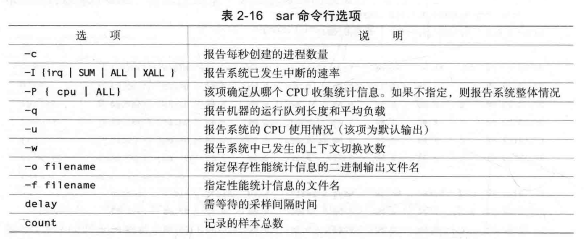

## sar

最广泛用于监视但一操作系统的工具

## 相关选项



## sar cpu 显示说明


## sar -0 /tmp/apache_test 1 3
命令要求每秒有三个CPU采样，其结果保存到二进制文件/
tmp/apache_test。该命令没有任何可视化输出，完成即返回。

使用sar读取文件
*sar -f /tmp/apache_test* 

适合倒入关系型数据库的格式
*sar -f /tmp/apache_test H*

种易于被标准Linux工具，如awk，perl，python或grep，解析的统计数据输出格式
*sar -f/tmp/apache_test.h*

sar显示每秒上下文切换的数量，以及创建金成熟，还要求sar给出平均负载信息
*sar -w -c -q 1 2*


### sar -u

显示所有 CPU

### sar -P ALL

当前系统指定CPU使用情况

  - %nice: Percentage of CPU utilization that occurred while executing at the user level with nice priority.

  - %steal: Percentage of time spent in involuntary wait by the virtual CPU or CPUs while the hypervisor was servicing another virtual processor.

**check out historical data**
```sh
sar -f /var/log/sysstat/<log_file_name>
```

**参数**
-u（获取 CPU 状态） 、-r（获取内存状态） 、-d（获取磁盘）

### sar -d
通过 **sar -d**，可以对系统的磁盘 IO 做一个基本的统计

  - DEV 表示磁盘设备名称。

  - tps 表示每秒到物理磁盘的传送数，也就是每秒的 I/O 流量。一个传送就是一个 I/O 请求，多个逻辑请求可以被合并为一个物理 I/O 请求。

  - rd_sec/s 表示每秒从设备读取的扇区数（1 扇区=512 字节）。

  - wr_sec/s 表示每秒写入设备的扇区数目。

  - avgrq-sz 表示平均每次设备 I/O 操作的数据大小（以扇区为单位）,类似于超市排队中每人所买东西的多少

  - avgqu-sz 表示平均 I/O 队列长度。 超市排队中单位时间内平均排队的人数

  - await 表示平均每次设备 I/O 操作的等待时间（以毫秒为单位） 。类似于超市排队中每人的等待时间

  - svctm表示平均每次设备 I/O 操作的服务时间（以毫秒为单位） 。超市排队中收银员的收款速度

  - %util表示一秒中有百分之几的时间用于 I/O 操作。类似于超市收银台前有人排队的时间比例
>对于磁盘 IO 性能，一般有如下评判标准：

  正常情况下 svctm 应该是小于 await 值的，而 svctm 的大小和磁盘性能有关，CPU、内存的负荷也会对 svctm值造成影响，过多的请求也会间接的导致 svctm值的增加。

  await 值的大小一般取决于 svctm 的值和 I/O 队列长度以及 I/O 请求模式，如果 svctm的值与 await 很接近，表示几乎没有 I/O 等待，磁盘性能很好，如果 await 的值远高于 svctm的值，则表示 I/O 队列等待太长，系统上运行的应用程序将变慢，此时可以通过更换更快的硬盘来解决问题。

  %util 项的值也是衡量磁盘 I/O 的一个重要指标，如果%util 接近 100%，表示磁盘产生的 I/O 请求太多，I/O 系统已经满负荷的在工作，该磁盘可能存在瓶颈。长期下去，势必影响系统的性能，可以通过优化程序或者通过更换更高、更快的磁盘来解决此问题。

### sar -n TCP,ETCP,DEV 1
<!-- sudo sar -n UDP 1 -->

sar 命令在这里用于查看 TCP 连接状态，其中包括：

active/s：每秒本地发起的 TCP 连接数，既通过 connect 调用创建的 TCP 连接；
passive/s：每秒远程发起的 TCP 连接数，即通过 accept 调用创建的 TCP 连接；
retrans/s：每秒 TCP 重传数量；
TCP连接数可以用来判断性能问题是否由于建立了过多的连接，进一步可以判断是主动发起的连接，还是被动接受的连接。TCP 重传可能是因为网络环境恶劣，或者服务器压力过大导致丢包。

### sar -n DEV 1
sar命令在这里可以查看网络设备的吞吐率。在排查性能问题时，可以通过网络设备的吞吐量，判断网络设备是否已经饱和。如示例输出中，eth0网卡设备，吞吐率大概在22Mbytes/s，即176Mbits/sec，没有达到1Gbit/sec的硬件上限。

### sar -r
内存

